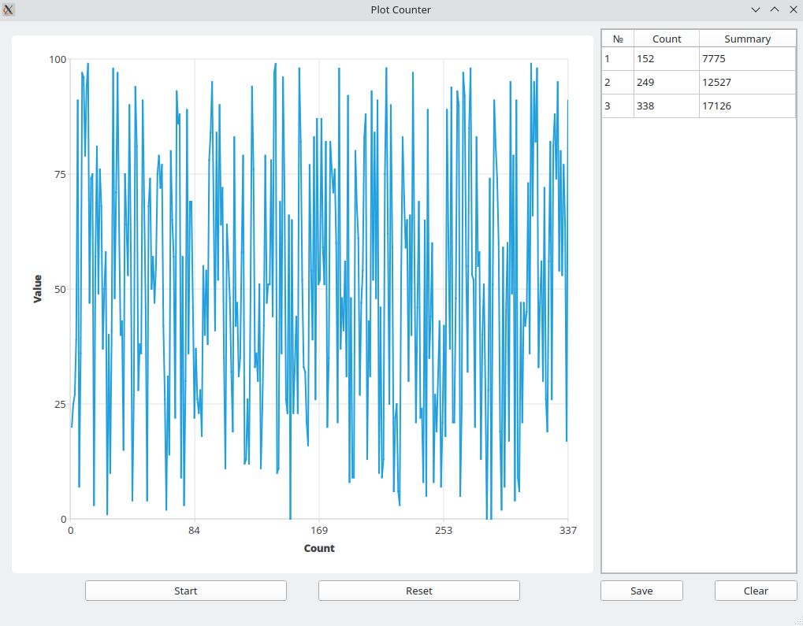

# PlotCounter
Графическое приложение на Qt, генерирующее точки на графике и подсчитывающее статистику



## Зависимости
```
qt6
qt6-charts
```

## Пример сборки и запуска
```bash
$ qmake PlotCounter.pro
$ sudo make install
$ cd /opt/PlotCounter/bin
$ ./PlotCounter
```

## Архитектура приложения

Приложение состоит из 3 классов: класс-контроллер `Controller`, инициализирующий отдельный поток и переносящий в него объект класса `DotGenerator`, который генерирует новые точки по запросу. Класс, отвечающий за графическую состовляющую программы `MainWindow` связан с `Controller` сигналами и слотами.

Документация представлена в виде Doxygen в директории `docs (index.html)`

## Взаимодействие с графическим интерфейсом

Пользователь имеет возможность остановить, продолжить или сбросить график в любой момент времени.

* Кнопка `Start` - запускает генерацию новых точек
* Кнопка `Stop` - останавливает генерацию новых точек
* Кнопка `Reset` - сбрасывает график
* Кнопка `Save` - добавляет текущий результат в таблицу
* Кнопка `Clear` - очищает таблицу результатов

## Пример использования приложения


